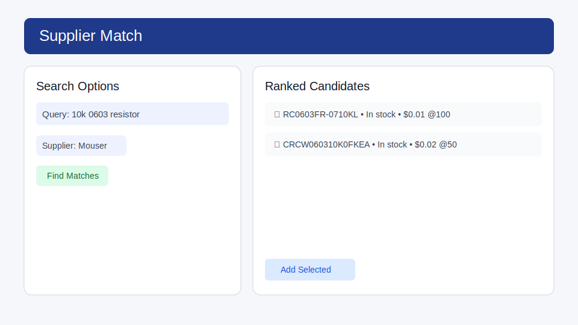
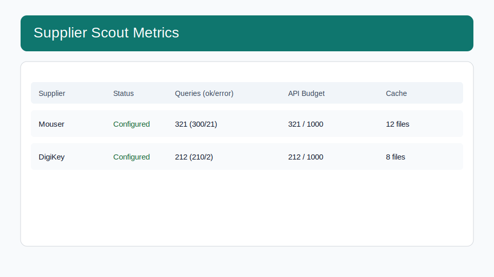
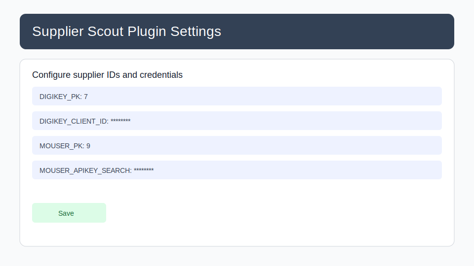

# Getting Started (Web UI)

This quickstart walks through the day-to-day Supplier Scout workflow in the InvenTree web interface.

## 1) Open a purchaseable part

Open any purchaseable part record, then use the **Supplier Match** action in the part actions bar.

## 2) Search and review matches

In the Supplier Match panel:

1. Confirm or edit the generated search query.
2. Choose a supplier (or all configured suppliers).
3. Click **Find Matches**.
4. Review ranked candidates (part number, stock, and pricing).

## 3) Import selected candidates

Select one or more rows and click **Add Selected** to create or update supplier parts and import price breaks.

## 4) Monitor API usage from the dashboard

Open the InvenTree dashboard to see **Supplier Scout Metrics** for query volume, API budget usage, and cache diagnostics.

## 5) Verify plugin settings

If UI actions are missing, check plugin settings and supplier credentials first.

## Troubleshooting checklist

- Confirm a supplier company ID is configured (`DIGIKEY_PK` and/or `MOUSER_PK`).
- Confirm supplier credentials are set globally or per-user.
- Confirm your InvenTree system has plugin UI integration enabled.
- For async/scheduled operations, confirm the background worker is running.

For endpoint-level troubleshooting and payload details, see [API.md](API.md).
